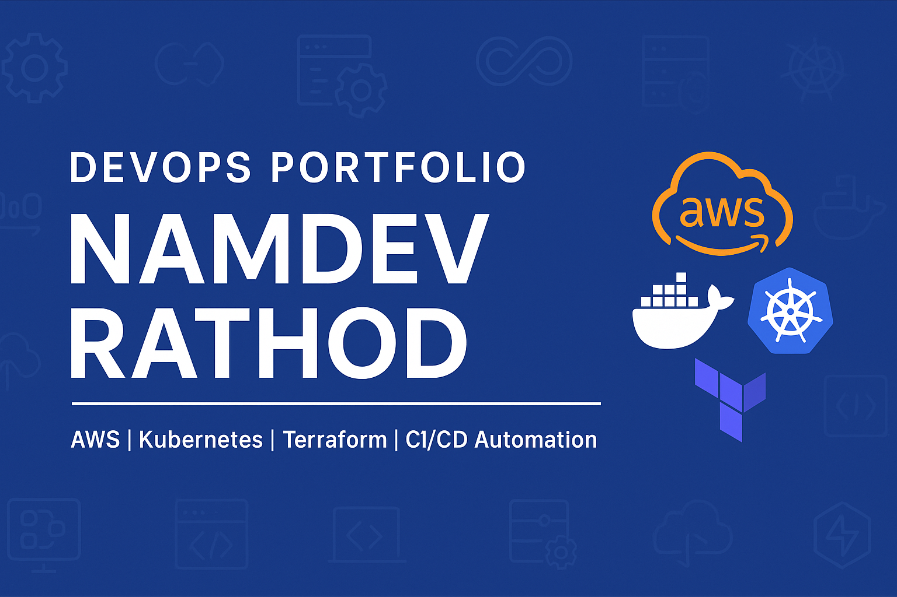

# 🚀 **DevOps Portfolio – Namdev Rathod**

### **Senior DevOps Engineer | AWS | Kubernetes | Terraform | CI/CD Automation**

📧 **Email:** [namdev.devops@gmail.com](mailto:namdev.devops@gmail.com)

📱 **WhatsApp:** +91-7276-12-1983

🌐 **YouTube:** [https://www.youtube.com/@namdev.devops](https://www.youtube.com/@namdev.devops)

🔗 **GitHub:** [https://github.com/namdev-rathod](https://github.com/namdev-rathod)

---

  

## 🧑‍💻 **About Me**

I am **Namdev Rathod**, a **Senior DevOps Engineer** with over **14 years of experience** across industries like **Web Hosting, E-Commerce, Logistics, Banking, Support Services, and Data Centers**.

I help businesses build **secure, scalable, automated, highly-available cloud architectures** using AWS, Kubernetes, Docker, Terraform, CI/CD, and advanced DevOps tooling.

This repository showcases my **professional DevOps portfolio** and acts as a central hub for my work, solutions, projects, and cloud architectures.

---

## 🏆 **Key Skills & Technologies**

### 🔹 **Cloud & DevOps**

* AWS (EC2, VPC, RDS, S3, EKS, Lambda, CloudFront, IAM, WAF, ALB)
* AWS DevOps & Automation
* CI/CD (Jenkins, GitHub Actions)
* Git, GitHub, GitOps

### 🔹 **Containers & Orchestration**

* Docker
* Kubernetes (EKS)
* Helm Charts
* Autoscaling (HPA), Ingress, Load Balancers

### 🔹 **Infrastructure as Code**

* Terraform
* AWS CDK
* CloudFormation (basic)

### 🔹 **Monitoring, Logging & Security**

* CloudWatch
* Prometheus + Grafana
* Security Hardening
* Cost Optimization

### 🔹 **Additional Tools**

* SonarQube
* Nginx, Apache
* Linux Administration
* Bash & Shell Scripting

---

## 📂 **What This Portfolio Contains**

This repo contains **end-to-end DevOps projects**, including:

### ✔️ **1. AWS Cloud Architectures**

* VPC Architecture
* EKS Cluster Setup
* Multi-tier Application Architecture
* High-Availability & Auto Scaling

### ✔️ **2. CI/CD Pipelines**

* Jenkins Pipelines
* GitHub Actions Workflows
* Docker Build/Push automation
* Deployment pipelines to EKS / EC2

### ✔️ **3. Kubernetes Projects**

* Deployment, Service, Ingress
* HPA Autoscaling setup
* EKS cluster bootstrap
* Observability stack

### ✔️ **4. Terraform & CDK Projects**

* VPC modules
* EC2/EKS infrastructure-as-code
* IAM roles automation
* Reusable cloud modules

### ✔️ **5. Automation Scripts**

* Bash scripts for deployments
* AWS CLI automation
* Backup scripts
* Security audits

### ✔️ **6. Documentation & Guides**

* DevOps best practices
* Architecture diagrams
* Troubleshooting guides

---

## 🎯 **Who This Portfolio Is For**

This portfolio is designed for:

* ✔️ IT Clients
* ✔️ Recruiters
* ✔️ Freelancing Platforms (Upwork/Fiverr)
* ✔️ Cloud Architects evaluating my work
* ✔️ Engineering Teams looking for consulting support

---

## 📞 **Contact Me**

If you are looking for **DevOps consulting, cloud architecture, CI/CD automation, or freelance project support**, feel free to contact me.

📧 **Email:** [namdev.devops@gmail.com](mailto:namdev.devops@gmail.com)
📱 **WhatsApp:** +91-7276-12-1983

---

## ⭐ **Show Your Support**

If you like this portfolio, please ⭐ **star this repository** — it motivates me to share more real-world DevOps projects.

---